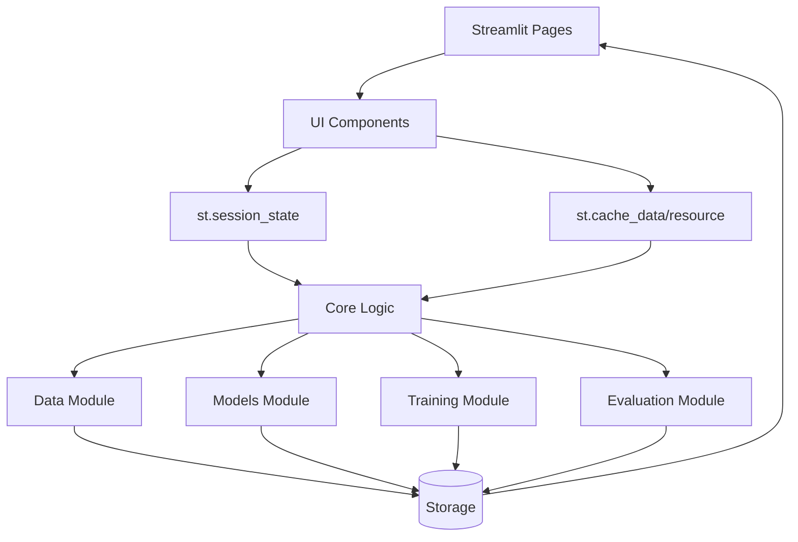
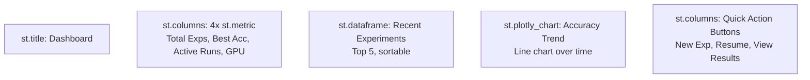
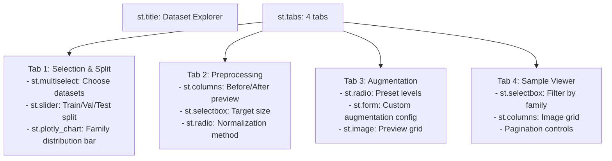
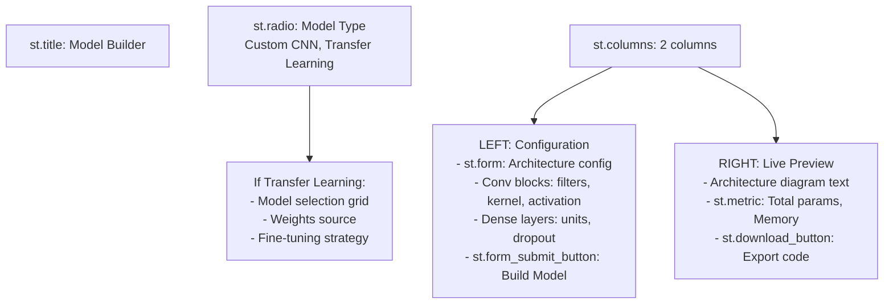
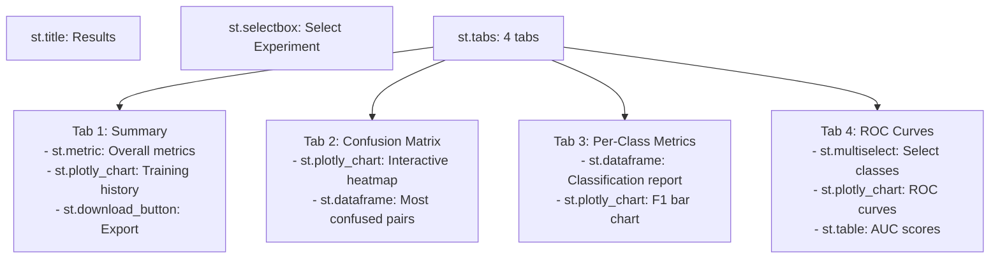
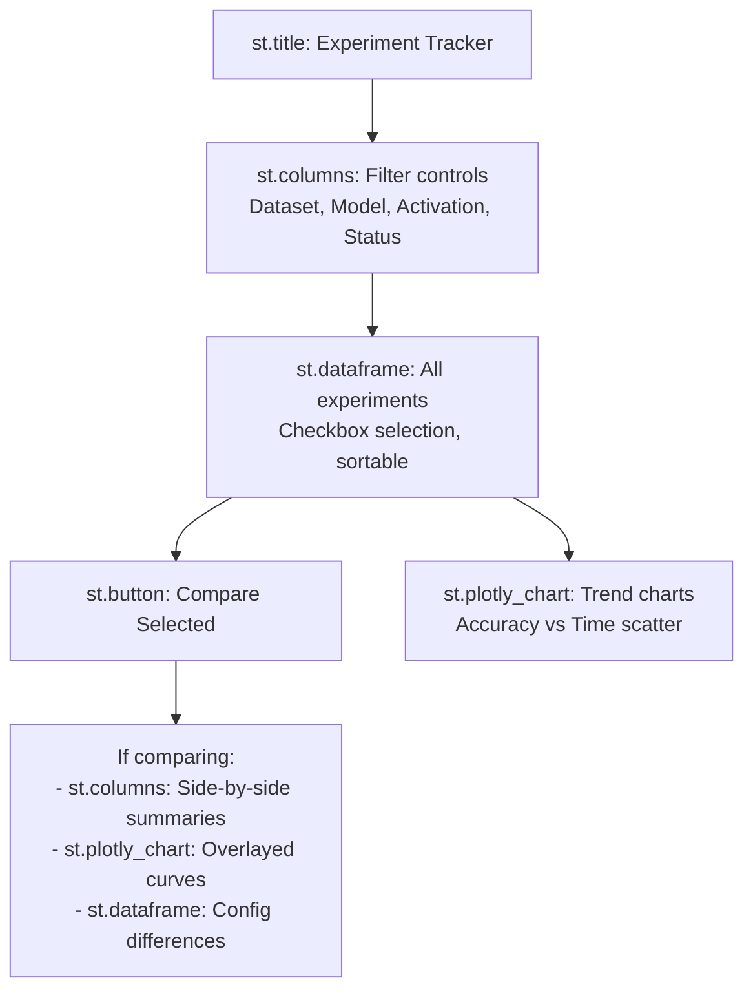
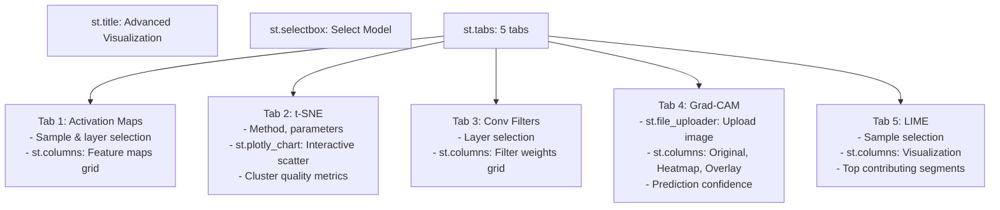

# Streamlit UI Architecture
## Malware Classification Dashboard

---

## 📁 Project Structure

```
streamlit_malware_classifier/
│
├── app.py                              # Main entry + navigation
│
├── pages/                              # 7 main pages
│   ├── 01_🏠_dashboard
│   ├── 02_📊_dataset_explorer
│   ├── 03_🔧_model_builder
│   ├── 04_⚙️_training
│   ├── 05_📈_results
│   ├── 06_🔬_experiments
│   └── 07_🎨_visualization
│
├── components/                         # Reusable UI components
│   ├── sidebar/
│   │   ├── navigation.py
│   │   ├── quick_stats.py
│   │   └── experiment_selector.py
│   │
│   ├── dataset/
│   │   ├── dataset_selector.py
│   │   ├── split_config.py
│   │   ├── augmentation_panel.py
│   │   ├── sample_viewer.py
│   │   └── preprocessing_preview.py
│   │
│   ├── model/
│   │   ├── architecture_selector.py
│   │   ├── layer_builder.py
│   │   ├── activation_selector.py
│   │   └── model_summary.py
│   │
│   ├── training/
│   │   ├── hyperparameter_panel.py
│   │   ├── callbacks_config.py
│   │   ├── training_monitor.py
│   │   └── live_charts.py
│   │
│   ├── results/
│   │   ├── metrics_cards.py
│   │   ├── confusion_matrix.py
│   │   ├── classification_report.py
│   │   └── roc_curves.py
│   │
│   └── visualization/
│       ├── activation_maps.py
│       ├── tsne_plot.py
│       ├── gradcam.py
│       └── lime_explainer.py
│
├── core/                               # Business logic (non-UI)
│   ├── data/
│   │   ├── loaders.py
│   │   ├── preprocessors.py
│   │   └── augmentations.py
│   │
│   ├── models/
│   │   ├── baseline_cnn.py
│   │   ├── transfer_learning.py
│   │   └── activations.py
│   │
│   ├── training/
│   │   ├── trainer.py
│   │   └── callbacks.py
│   │
│   └── evaluation/
│       ├── metrics.py
│       └── visualization.py
│
├── utils/
│   ├── state.py                        # Session state helpers
│   ├── config.py                       # Config management
│   └── io.py                           # File I/O
│
├── experiments/                        # Data storage
│   └── registry.json
│
└── .streamlit/
    └── config.toml
```

---

## 🔄 Data Flow



---

## 🛠️ Streamlit Components We'll Use

### Essential Components

**Layout:**
- `st.columns()`, `st.tabs()`, `st.container()`, `st.expander()`, `st.sidebar`
- `st.empty()` for real-time updates

**Inputs:**
- `st.slider()` - continuous values (LR, dropout, epochs)
- `st.selectbox()` - single choice (optimizer, activation)
- `st.multiselect()` - multiple choices (datasets, classes to display)
- `st.checkbox()`, `st.radio()`, `st.toggle()`
- `st.button()`, `st.download_button()`
- `st.text_input()`, `st.text_area()`, `st.file_uploader()`

**Display:**
- `st.dataframe()` - interactive tables
- `st.metric()` - key stats with delta
- `st.plotly_chart()` - ALL charts (training curves, confusion matrix, ROC, t-SNE)
- `st.image()` - malware images, heatmaps

**Status:**
- `st.progress()`, `st.spinner()`, `st.status()`
- `st.success()`, `st.info()`, `st.warning()`, `st.error()`, `st.toast()`

**State & Caching:**
- `st.session_state` - persist data across pages
- `@st.cache_data` - cache expensive operations (dataset loading)
- `@st.cache_resource` - cache singletons (models)

**Execution:**
- `st.form()` + `st.form_submit_button()` - batch submit hyperparameters
- `@st.fragment(run_every="1s")` - auto-refresh training metrics
- `st.rerun()` - force refresh

**Navigation:**
- `st.set_page_config()`, `st.navigation()`, `st.Page()`

---

## 🎨 Page Layouts

### Page 1: 🏠 Dashboard



### Page 2: 📊 Dataset Explorer



### Page 3: 🔧 Model Builder



### Page 4: ⚙️ Training Control Center

```mermaid
graph TD
    TITLE[st.title: Training Control]

    CONFIG[st.columns: 3 columns<br/>Optimizer | Scheduler | Callbacks]

    FORM[st.form: Training Parameters<br/>- Epochs, batch size, regularization<br/>- Experiment name, description, tags<br/>- st.form_submit_button: Start Training]

    BTNS[Control Buttons<br/>Start, Pause, Stop, Save Config]

    MONITOR[@st.fragment run_every=1s<br/>Live Monitoring:<br/>- st.status: Training status<br/>- st.progress: Epoch progress<br/>- st.metric: Current metrics<br/>- st.plotly_chart: Live curves<br/>- Log output]

    TITLE --> CONFIG --> FORM --> BTNS --> MONITOR
```

### Page 5: 📈 Results



### Page 6: 🔬 Experiments



### Page 7: 🎨 Visualization



### Sidebar (Global, All Pages)

```mermaid
graph TD
    LOGO[st.logo: Project Logo]
    NAV[st.navigation: Page links]
    DIV1[st.divider]
    EXP[st.selectbox: Active Experiment]
    DIV2[st.divider]
    STATS[st.metric: Quick stats x3]
    DIV3[st.divider]
    BTNS[st.button: Quick actions]
    DIV4[st.divider]
    LINKS[Resource links]
    DIV5[st.divider]
    SETTINGS[st.toggle: Settings<br/>Dark mode, Auto-refresh]
```



---

## 💻 Key Implementation Patterns

### State Management

```python
# app.py - Initialize once
if 'experiments' not in st.session_state:
    st.session_state.experiments = []
if 'current_experiment' not in st.session_state:
    st.session_state.current_experiment = None
if 'training_status' not in st.session_state:
    st.session_state.training_status = 'idle'
```

### Real-time Training with Fragments

```python
@st.fragment(run_every="1s")
def live_training_monitor():
    if st.session_state.training_status != 'running':
        return

    metrics = st.session_state.get('latest_metrics', {})

    col1, col2, col3 = st.columns(3)
    col1.metric("Epoch", metrics.get('epoch', 0))
    col2.metric("Loss", f"{metrics.get('loss', 0):.4f}")
    col3.metric("Acc", f"{metrics.get('acc', 0):.2%}")

    st.progress(metrics.get('epoch', 0) / metrics.get('total_epochs', 100))

    # Update chart
    history = st.session_state.get('training_history', [])
    fig = create_training_curve(history)
    st.plotly_chart(fig)
```

### Caching

```python
@st.cache_data
def load_dataset(name):
    # Expensive data loading
    return dataset

@st.cache_resource
def load_model(path):
    # Singleton model loading
    return model
```

### Forms for Batch Submit

```python
with st.form("hyperparameters"):
    col1, col2, col3 = st.columns(3)

    with col1:
        lr = st.slider("Learning Rate", 0.0001, 0.01, 0.001)
    with col2:
        batch_size = st.selectbox("Batch Size", [16, 32, 64])
    with col3:
        epochs = st.slider("Epochs", 10, 200, 100)

    submitted = st.form_submit_button("Start Training")
    if submitted:
        st.session_state.config = {'lr': lr, 'batch': batch_size, 'epochs': epochs}
        st.success("Training started!")
```

### Multi-page Navigation

```python
# app.py
st.set_page_config(page_title="Malware Classifier", layout="wide")

dashboard = st.Page("pages/01_🏠_dashboard.py", title="Dashboard", icon="🏠")
dataset = st.Page("pages/02_📊_dataset_explorer.py", title="Dataset", icon="📊")
# ... other pages

pg = st.navigation({
    "Main": [dashboard],
    "Workflow": [dataset, model, training, results],
    "Analysis": [experiments, visualization]
})

pg.run()
```

---

## 📊 Plotly Chart Examples

```python
# Confusion matrix
fig = px.imshow(cm, text_auto=True, color_continuous_scale="Blues")
st.plotly_chart(fig)

# Training curves
fig = go.Figure()
fig.add_trace(go.Scatter(y=history['loss'], name='Train Loss'))
fig.add_trace(go.Scatter(y=history['val_loss'], name='Val Loss'))
st.plotly_chart(fig)

# ROC curves
for i, class_name in enumerate(classes):
    fig.add_trace(go.Scatter(x=fpr[i], y=tpr[i], name=f'{class_name} (AUC={auc[i]:.2f})'))
st.plotly_chart(fig)

# t-SNE scatter
fig = px.scatter(df, x='x', y='y', color='family', hover_data=['sample_id'])
st.plotly_chart(fig)
```

---

Done. Clean, practical, no fluff.
