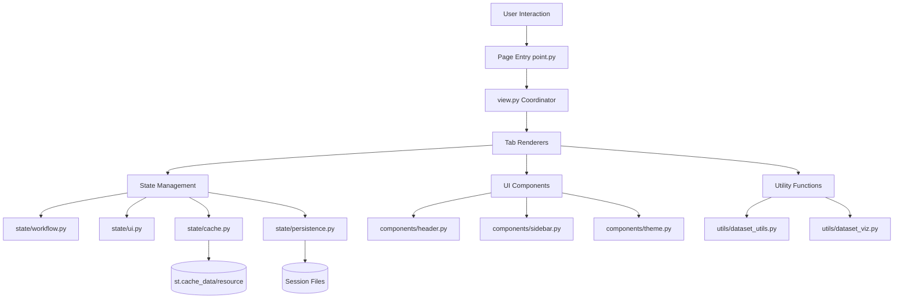

# Streamlit UI Architecture
## Malware Classification Dashboard

**Status:** Production Implementation
**Project:** Proyecto Final - Sistemas Inteligentes II
**Institution:** Universidad de Caldas

---

## 📁 Current Project Structure

```
app/
├── main.py                              # Entry point + navigation setup
│
├── content/                             # Self-contained page modules
│   ├── home/
│   │   ├── page.py                      # Entry point
│   │   └── view.py                      # Home page view logic
│   │
│   ├── dataset/                         # Dataset configuration module
│   │   ├── page.py                      # Entry point
│   │   ├── view.py                      # Main coordinator with tabs
│   │   └── tabs/
│   │       ├── overview.py              # Dataset selection & split configuration
│   │       ├── distribution.py          # Class distribution visualization
│   │       ├── augmentation.py          # Data augmentation settings
│   │       └── samples.py               # Sample image viewer
│   │
│   ├── model/                           # Model builder (in progress)
│   │   ├── page.py
│   │   └── view.py
│   │
│   ├── training/                        # Training configuration (in progress)
│   │   ├── page.py
│   │   └── view.py
│   │
│   ├── monitor/                         # Training monitor (in progress)
│   │   ├── page.py
│   │   └── view.py
│   │
│   ├── results/                         # Results & evaluation (planned)
│   │   ├── page.py
│   │   └── view.py
│   │
│   └── interpret/                       # Model interpretability (planned)
│       ├── page.py
│       └── view.py
│
├── components/                          # Shared UI components (flat structure)
│   ├── header.py                        # App header with session info
│   ├── sidebar.py                       # Configuration status sidebar
│   ├── theme.py                         # Theme customization
│   ├── styling.py                       # CSS injection
│   └── utils.py                         # GPU detection, session management
│
├── state/                               # Session state management (NO __init__.py)
│   ├── workflow.py                      # ML workflow state (configs, training)
│   ├── ui.py                            # UI preferences (theme, past sessions)
│   ├── cache.py                         # Cached data (dataset scans, splits)
│   ├── session_state.py                 # Session state utilities
│   └── persistence.py                   # Session persistence to disk
│
├── utils/                               # Utility functions
│   ├── dataset_utils.py                 # Dataset scanning & processing
│   ├── dataset_sections.py              # Dataset section helpers
│   └── dataset_viz.py                   # Dataset visualizations
│
├── config.py                            # Application configuration
├── constants.py                         # Application constants
│
└── .streamlit/
    └── config.toml                      # Streamlit theme & server config
```

---

## 🏗️ Architecture Principles

### 1. **Self-Contained Page Modules**
Each page in `content/` is fully self-contained in its own folder with:
- `page.py` - Entry point that renders header/sidebar and calls view
- `view.py` - Main view logic and coordinator
- `tabs/` - Optional subfolder for complex multi-tab pages

### 2. **Tab-Based Content Organization**
Complex pages (like Dataset) split content into multiple tab files:
```python
# content/dataset/view.py
def render():
    tabs = st.tabs(["Overview", "Distribution", "Augmentation", "Samples"])
    with tabs[0]:
        overview.render()
    with tabs[1]:
        distribution.render()
    # ...
```

### 3. **No __init__.py Files**
All imports use absolute paths from project root:
```python
from content.dataset.view import render
from state.workflow import get_dataset_config
from components.header import render_header
```

### 4. **State Management Abstraction**
All session state access goes through `state/` module functions:
- **NEVER** access `st.session_state` directly
- **ALWAYS** use functions from `state/workflow.py`, `state/ui.py`, or `state/cache.py`

```python
# ❌ Don't do this
value = st.session_state.dataset_config

# ✅ Do this
from state.workflow import get_dataset_config
value = get_dataset_config()
```

### 5. **Flat Component Structure**
Shared components stay in flat `components/` directory, not nested by category.

---

## 🔄 Data Flow Architecture



---

## 🗺️ Navigation Structure

### Current Pages

**Main**
- 🏠 **Home** (`/home`) - Session setup and overview

**Workflow**
- 📊 **Dataset** (`/dataset`) - Dataset configuration with 4 tabs
- 🧠 **Model** (`/model`) - Model architecture builder
- ⚙️ **Training** (`/training`) - Training hyperparameter configuration
- 📈 **Monitor** (`/monitor`) - Live training monitoring
- 🎯 **Results** (`/results`) - Results and evaluation metrics
- 🔍 **Interpretability** (`/interpretability`) - Model interpretation tools

### Status Indicators (Sidebar)

Configuration status is shown in sidebar:
- ✅ Dataset configured
- ✅ Model configured
- ✅ Training configured

Status updates automatically based on workflow state.

---

## 📊 Implemented Features

### ✅ Core Infrastructure

**State Management**
- `state/workflow.py` - ML workflow configuration state
- `state/ui.py` - UI preferences and theme
- `state/cache.py` - Cached dataset scans and expensive operations
- `state/persistence.py` - Session save/load functionality
- TypedDict definitions for type safety

**Components**
- Header with session ID and info
- Sidebar with configuration status
- Theme customization (4 presets: Green, Blue, Pink, Orange)
- Dynamic CSS injection
- GPU detection and memory monitoring

**Navigation**
- Multi-page navigation with `st.navigation()`
- URL routing for direct page access
- Grouped navigation (Main, Workflow)

### ✅ Dataset Module (Complete)

**Tab 1: Overview**
- Automated dataset scanning from `repo/malware/`
- Train/validation/test split configuration with sliders
- Dataset metadata display
- Configuration validation

**Tab 2: Distribution**
- Class distribution bar chart
- Family statistics
- Sample counts per class

**Tab 3: Augmentation**
- Augmentation preset selection (None, Light, Medium, Heavy)
- Custom augmentation configuration
- Preview of augmentation effects

**Tab 4: Samples**
- Sample image viewer with pagination
- Filter by malware family
- Image grid display
- Metadata display per sample

**Dataset Utilities**
- `utils/dataset_utils.py` - Dataset scanning and processing
- `utils/dataset_viz.py` - Visualization functions
- Cached dataset loading with `@st.cache_data`

### 🔄 In Progress

**Model Builder**
- PyTorch architecture configuration
- Transfer learning support
- Custom CNN builder
- Model summary visualization

**Training Configuration**
- Hyperparameter selection
- Optimizer configuration
- Learning rate scheduling
- Callbacks setup

**Training Monitor**
- Live training metrics with `@st.fragment(run_every="1s")`
- Training curves (loss, accuracy)
- Progress bars
- Stop/pause controls

### 🔜 Planned

**Results & Evaluation**
- Confusion matrix visualization
- Per-class metrics (precision, recall, F1)
- ROC curves and AUC scores
- Training history plots
- Model comparison

**Interpretability**
- Grad-CAM visualization
- t-SNE embeddings
- Activation map visualization
- LIME explanations
- Filter visualization

---

## 🛠️ Streamlit Components Used

### Layout Components
```python
st.columns()           # Multi-column layouts
st.tabs()              # Tabbed content organization
st.container()         # Content grouping
st.expander()          # Collapsible sections
st.sidebar             # Sidebar content
st.empty()             # Placeholder for updates
```

### Input Components
```python
st.slider()            # Numeric ranges (split ratios, epochs, LR)
st.selectbox()         # Single choice (optimizer, activation)
st.multiselect()       # Multiple choices (datasets, classes)
st.checkbox()          # Boolean flags
st.radio()             # Radio button groups
st.toggle()            # Toggle switches
st.button()            # Action buttons
st.file_uploader()     # File uploads
st.color_picker()      # Theme color selection
```

### Display Components
```python
st.dataframe()         # Interactive tables
st.metric()            # Key metrics with delta
st.plotly_chart()      # All visualizations
st.image()             # Image display
st.markdown()          # Formatted text
```

### Status Components
```python
st.progress()          # Progress bars
st.spinner()           # Loading indicators
st.status()            # Status messages
st.success()           # Success messages
st.info()              # Info messages
st.warning()           # Warning messages
st.error()             # Error messages
st.toast()             # Toast notifications
```

### State & Caching
```python
st.session_state       # (accessed via state/ modules only)
@st.cache_data         # Cache expensive data operations
@st.cache_resource     # Cache singletons (models, connections)
```

### Execution Control
```python
st.form()              # Batch submit forms
@st.fragment(run_every="1s")  # Auto-refresh fragments
st.rerun()             # Force page rerun
```

---

## 💻 Implementation Patterns

### State Management Pattern

```python
# state/workflow.py

class WorkflowState(TypedDict, total=False):
    """Type definition for workflow state fields"""
    session_id: str
    dataset_config: dict[str, Any]
    model_config: dict[str, Any]
    training_config: dict[str, Any]
    training_active: bool
    results: dict[str, Any] | None

def init_workflow_state() -> None:
    """Initialize workflow state with defaults"""
    if "session_id" not in st.session_state:
        st.session_state.session_id = generate_session_id()
    # ... initialize other fields

def save_dataset_config(config: dict[str, Any]) -> None:
    """Save dataset config to state and persist to disk"""
    st.session_state.dataset_config = config
    from state.persistence import save_session
    save_session(get_session_id())

def get_dataset_config() -> dict[str, Any]:
    """Retrieve dataset configuration"""
    return st.session_state.get("dataset_config", {})
```

### Page Structure Pattern

```python
# content/dataset/page.py
from components.header import render_header
from components.sidebar import render_sidebar
from content.dataset import view

render_header()
render_sidebar()
view.render()
```

```python
# content/dataset/view.py
import streamlit as st
from content.dataset.tabs import overview, distribution, augmentation, samples

def render():
    st.title("📊 Dataset Configuration")

    tabs = st.tabs([
        "📋 Overview",
        "📊 Distribution",
        "🔄 Augmentation",
        "🖼️ Samples"
    ])

    with tabs[0]:
        overview.render()
    with tabs[1]:
        distribution.render()
    with tabs[2]:
        augmentation.render()
    with tabs[3]:
        samples.render()
```

### Caching Pattern

```python
# utils/dataset_utils.py

@st.cache_data(ttl=300)  # Cache for 5 minutes
def scan_dataset_directory(base_path: str) -> dict[str, Any]:
    """Expensive dataset scanning operation"""
    families = []
    for family_dir in Path(base_path).iterdir():
        if family_dir.is_dir():
            samples = list(family_dir.glob("*.png"))
            families.append({
                "name": family_dir.name,
                "count": len(samples),
                "path": str(family_dir)
            })
    return {"families": families, "total": sum(f["count"] for f in families)}

@st.cache_resource
def load_trained_model(model_path: str):
    """Singleton model loading - only loaded once"""
    import torch
    return torch.load(model_path)
```

### Real-Time Updates Pattern

```python
# content/monitor/view.py

@st.fragment(run_every="1s")
def live_training_monitor():
    """Auto-refresh training metrics every second"""
    from state.workflow import is_training_active, get_results

    if not is_training_active():
        st.info("No active training session")
        return

    # Get latest metrics from session state
    results = get_results()
    if not results:
        return

    # Display live metrics
    col1, col2, col3 = st.columns(3)
    col1.metric("Epoch", results.get("epoch", 0))
    col2.metric("Loss", f"{results.get('loss', 0):.4f}")
    col3.metric("Accuracy", f"{results.get('accuracy', 0):.2%}")

    # Update training curves
    import plotly.graph_objects as go
    fig = go.Figure()
    fig.add_trace(go.Scatter(
        y=results.get("loss_history", []),
        name="Loss"
    ))
    st.plotly_chart(fig, use_container_width=True)
```

### Form Submission Pattern

```python
# content/training/view.py

with st.form("training_config"):
    st.subheader("Training Configuration")

    col1, col2, col3 = st.columns(3)

    with col1:
        epochs = st.slider("Epochs", 10, 500, 100)
        batch_size = st.selectbox("Batch Size", [16, 32, 64, 128])

    with col2:
        learning_rate = st.slider(
            "Learning Rate",
            0.0001, 0.1, 0.001,
            format="%.4f"
        )
        optimizer = st.selectbox(
            "Optimizer",
            ["Adam", "SGD", "RMSprop"]
        )

    with col3:
        weight_decay = st.slider(
            "Weight Decay",
            0.0, 0.01, 0.0001,
            format="%.4f"
        )
        momentum = st.slider("Momentum", 0.0, 0.99, 0.9)

    submitted = st.form_submit_button("💾 Save Configuration")

    if submitted:
        from state.workflow import save_training_config

        config = {
            "epochs": epochs,
            "batch_size": batch_size,
            "learning_rate": learning_rate,
            "optimizer": optimizer,
            "weight_decay": weight_decay,
            "momentum": momentum
        }

        save_training_config(config)
        st.success("✅ Training configuration saved!")
        st.rerun()
```

---

## 📊 Plotly Visualization Patterns

### Distribution Bar Chart
```python
import plotly.express as px

fig = px.bar(
    df,
    x="family",
    y="count",
    title="Malware Family Distribution",
    color="family",
    text="count"
)
fig.update_traces(textposition="outside")
st.plotly_chart(fig, use_container_width=True)
```

### Training Curves
```python
import plotly.graph_objects as go

fig = go.Figure()
fig.add_trace(go.Scatter(
    y=history['train_loss'],
    name='Train Loss',
    mode='lines'
))
fig.add_trace(go.Scatter(
    y=history['val_loss'],
    name='Val Loss',
    mode='lines'
))
fig.update_layout(
    title="Training History",
    xaxis_title="Epoch",
    yaxis_title="Loss"
)
st.plotly_chart(fig, use_container_width=True)
```

### Confusion Matrix Heatmap
```python
import plotly.express as px

fig = px.imshow(
    confusion_matrix,
    text_auto=True,
    color_continuous_scale="Blues",
    labels=dict(x="Predicted", y="Actual"),
    x=class_names,
    y=class_names
)
st.plotly_chart(fig, use_container_width=True)
```

### ROC Curves
```python
import plotly.graph_objects as go

fig = go.Figure()
for i, class_name in enumerate(class_names):
    fig.add_trace(go.Scatter(
        x=fpr[i],
        y=tpr[i],
        name=f'{class_name} (AUC={auc[i]:.3f})',
        mode='lines'
    ))

fig.add_trace(go.Scatter(
    x=[0, 1],
    y=[0, 1],
    name='Random',
    mode='lines',
    line=dict(dash='dash', color='gray')
))

fig.update_layout(
    title="ROC Curves",
    xaxis_title="False Positive Rate",
    yaxis_title="True Positive Rate"
)
st.plotly_chart(fig, use_container_width=True)
```

### t-SNE Scatter Plot
```python
import plotly.express as px

fig = px.scatter(
    df,
    x='tsne_x',
    y='tsne_y',
    color='family',
    hover_data=['sample_id', 'prediction'],
    title="t-SNE Feature Visualization"
)
st.plotly_chart(fig, use_container_width=True)
```

---

## 🎯 Development Guidelines

### Adding New Pages

1. **Create page folder** in `content/`
   ```bash
   mkdir content/new_page
   ```

2. **Create page.py** (entry point)
   ```python
   from components.header import render_header
   from components.sidebar import render_sidebar
   from content.new_page import view

   render_header()
   render_sidebar()
   view.render()
   ```

3. **Create view.py** (main logic)
   ```python
   import streamlit as st

   def render():
       st.title("New Page")
       # Page content here
   ```

4. **For complex pages, add tabs/**
   ```bash
   mkdir content/new_page/tabs
   # Create tab_*.py files
   ```

5. **Register in main.py**
   ```python
   st.Page("content/new_page/page.py", title="New Page", icon="🆕")
   ```

### State Management Rules

**DO:**
- Define TypedDict for new state fields in appropriate `state/` module
- Create getter/setter functions for state access
- Use `@st.cache_data` for expensive data operations
- Use `@st.cache_resource` for singleton objects (models, connections)
- Auto-save to disk after state changes

**DON'T:**
- Access `st.session_state` directly outside `state/` modules
- Store large objects in session state without caching
- Forget to initialize state in `init_*_state()` functions

### Component Guidelines

**Shared Components** → `components/`
- Header, sidebar, theme, styling
- Reusable across multiple pages

**Page-Specific Logic** → `content/page_name/`
- Stays within page folder
- Not imported by other pages

### Import Guidelines

**Always use absolute imports:**
```python
# ✅ Good
from state.workflow import get_dataset_config
from components.header import render_header
from content.dataset.tabs import overview

# ❌ Bad
from ..state.workflow import get_dataset_config
from .tabs import overview
```

---

## 🔍 Key Files Reference

### Entry Point
- `main.py` - App configuration, state initialization, navigation setup

### Core State Management
- `state/workflow.py` - ML workflow state (session_id, configs, training, results)
- `state/ui.py` - UI preferences (theme, past_sessions)
- `state/cache.py` - Cached operations (dataset scans)
- `state/persistence.py` - Session save/load to disk
- `state/session_state.py` - Session state utilities

### Shared Components
- `components/header.py` - App header with session info
- `components/sidebar.py` - Configuration status display
- `components/theme.py` - Theme customization UI
- `components/styling.py` - CSS injection
- `components/utils.py` - GPU detection, utilities

### Dataset Utilities
- `utils/dataset_utils.py` - Dataset scanning and processing
- `utils/dataset_sections.py` - Dataset section helpers
- `utils/dataset_viz.py` - Visualization functions

### Configuration
- `config.py` - Application configuration
- `constants.py` - Application constants
- `.streamlit/config.toml` - Streamlit configuration

---

## 🚀 Running the Application

```bash
cd app
streamlit run main.py
```

**Default URL:** `http://localhost:8501`

**Direct Page URLs:**
- `/home` - Home & Session
- `/dataset` - Dataset Configuration
- `/model` - Model Builder
- `/training` - Training Configuration
- `/monitor` - Training Monitor
- `/results` - Results & Evaluation
- `/interpretability` - Model Interpretability

---

## 📋 Next Implementation Steps

### Priority 1: Model Builder
- [ ] Architecture selection (Custom CNN, Transfer Learning)
- [ ] Layer configuration UI
- [ ] Model summary visualization
- [ ] PyTorch model instantiation
- [ ] Architecture export/import

### Priority 2: Training Pipeline
- [ ] Training configuration form
- [ ] Training loop implementation
- [ ] Background training with threading
- [ ] Live metric updates
- [ ] Checkpoint saving
- [ ] Training controls (pause, stop, resume)

### Priority 3: Results & Evaluation
- [ ] Metrics calculation (accuracy, precision, recall, F1)
- [ ] Confusion matrix visualization
- [ ] Per-class performance metrics
- [ ] ROC curves and AUC
- [ ] Training history plots
- [ ] Model comparison tools

### Priority 4: Interpretability
- [ ] Grad-CAM implementation
- [ ] t-SNE embeddings
- [ ] Activation map visualization
- [ ] LIME explanations
- [ ] Filter visualization
- [ ] Saliency maps

---

## 🎓 Project Evaluation Criteria

This application supports all five evaluation criteria from the course requirements:

### 1. Diseño del Experimento
- Clear hypothesis formulation UI
- Dataset selection and justification
- Train/val/test split configuration
- Metric selection
- Model comparison setup

### 2. Desarrollo del Experimento
- Reproducible pipeline implementation
- Hyperparameter tracking
- Configuration persistence
- Experiment logging
- Results storage

### 3. Análisis e Interpretación
- Numerical metrics visualization
- Learning curves analysis
- Confusion matrix analysis
- Attention/filter visualizations
- Model comparison tools

### 4. Uso de Juicio de Ingeniería
- Performance vs. cost analysis
- Model complexity trade-offs
- Training time monitoring
- Deployment recommendations
- GPU memory monitoring

### 5. Comunicación de los Resultados
- Clear, structured dashboard
- Exportable reports
- Presentation-ready visualizations
- Session persistence for demos
- Reproducible experiments

---

**Last Updated:** November 24, 2025
**Version:** 1.0 (Production)
