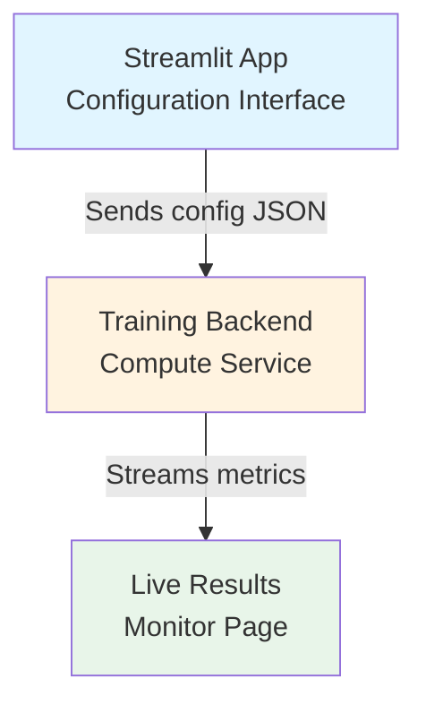
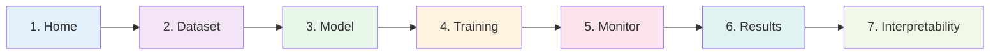

# Streamlit App - Overview & Architecture
## Malware Classification with Deep Learning

---

## App Structure

**Navigation:** Sidebar with page links (3-7 pages)
**Philosophy:** Each page is self-contained, linear workflow, scroll down to complete each step
**State Management:** All selections persist in `st.session_state` as you navigate
**Design Constraints:**
- Max 7, Min 3 sections per page
- Max 7, Min 3 tabs per section
- Prevents cognitive overload while maintaining flexibility

---

## Compute Strategy (GPU/CPU Management)

### Architecture: Separation of Concerns

**Problem:** Streamlit app runs on local machine, but training needs powerful GPU (Google Colab, cloud, etc.)

**Solution:** Decouple UI from compute

### Implementation Options

**Hybrid**
- App detects available resources (local GPU vs none)
- If local GPU available → execute locally
- If no GPU → offer "Export Config" button for Colab/cloud
- User uploads config to remote backend
- Remote backend sends results back (monitor page polls status)

### What This Means for the App

**Pages 1-4:** Pure configuration (no compute needed)
- Run anywhere, lightweight
- Generate training configuration JSON

**Page 5 (Monitor):** Streaming layer
- If local: Direct connection to training process
- If remote: Poll remote API for status updates
- Real-time metrics displayed via WebSocket or HTTP polling

**Pages 6-7:** Analysis/Visualization
- Load completed results from saved files
- Works regardless of where training happened

---

## Continuous Measurement Philosophy

**Traditional Approach:** Configure everything → train → hope for the best → evaluate at end

**Our Approach (GOOD):** Validate at every step

| Page | Validation/Measurement | Why |
|------|------------------------|-----|
| **Page 2: Dataset** | Class balance chart, image quality stats | Catch data issues before training |
| **Page 3: Model** | Param count, memory estimate, architecture diagram | Ensure model fits in memory |
| **Page 4: Training** | Config sanity checks, LR range warnings | Prevent bad hyperparameters |
| **Page 5: Monitor** | Live loss/accuracy curves, overfitting detection | Stop bad runs early |
| **Page 6: Results** | Comprehensive test metrics, confusion matrix | Final performance evaluation |
| **Page 7: Interpretability** | Grad-CAM, misclassification analysis | Understand what model learned |

---

## Visualization Requirements (Input → Process (can be multiple ones) → Output)

Every page should show:
1. **Input:** What configuration/data goes into this step
2. **Process:** Live visualization of what's happening (if applicable)
3. **Output:** Clear visual summary of results

Examples:
- **Dataset page:** Input = folder → Process = preview grid → Output = class distribution chart
- **Model page:** Input = layer configs → Process = architecture builder → Output = model diagram + param count
- **Training page:** Input = hyperparameters → Process = live loss curves → Output = final metrics

---

## Programming Principles

Always look at `.claude/CLAUDE.md`, first and second are a must.

## Design Principles

1. **Max 7, Min 3 sections per page** - Keeps pages manageable, forces focus
2. **Max 7, Min 3 tabs per section** - Prevents cognitive overload
3. **Linear workflow** - Each page builds on previous, scroll down to complete
4. **State persistence** - All selections saved in `st.session_state`
5. **Self-contained pages** - Each page does ONE thing well
6. **Progressive disclosure** - Use expanders for advanced options
7. **Immediate feedback** - Show previews, live updates where possible
8. **Clear CTAs** - Big obvious buttons to continue workflow
9. **Measure continuously** - Validate each step before moving forward

---

## App Pages Overview

1. **Home & Setup** - Project overview, session management
2. **Dataset Configuration** - Load combined dataset, configure splits, preview data
3. **Model Configuration** - Build custom CNN or select transfer learning model
4. **Training Configuration** - Set hyperparameters, optimizer, callbacks
5. **Training Monitor** - Live training progress, metrics, loss curves
6. **Results & Evaluation** - Test metrics, confusion matrix, classification report
7. **Model Interpretability** - Grad-CAM, t-SNE, activation maps, misclassification analysis

---

## Dataset Strategy (IMPORTANT)

**We use a single combined dataset:** `repo/`

This folder already contains ALL malware samples blended together from MalImg and Malevis.

Instead, configure:
- Train/val/test split ratios
- Preprocessing (resize, normalize)
- Augmentation strategies

---

## Technology Stack

- **Framework:** PyTorch (already in dependencies)
- **UI:** Streamlit (already in dependencies)
- **Visualization:** Plotly (interactive charts) + Mermaid (diagrams)
- **Dataset:** Located in `repo/` (combined/blended)
- **Compute:** Flexible (local or remote backend)
