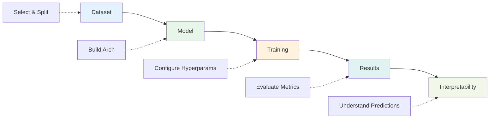
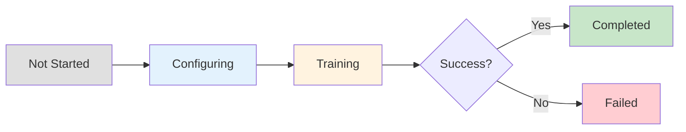

# Page 1: Home & Setup

## Why This Page Exists
**Purpose:** Entry point for users to understand the project, start new experiments, or resume previous work. Sets up session management and provides overview of available resources.

---

## Section 1: Project Overview

**Why:** Orient users to what the app does and what they can accomplish

**Input:** None (informational)
**Process:** Display project description
**Output:** Clear understanding of app capabilities

```
[st.title] Malware Classification with Deep Learning

[st.markdown] Brief description of the project

[st.expander "What does this app do?"]
    - Load combined malware dataset
    - Configure CNN architectures
    - Train models with different hyperparameters
    - Evaluate and visualize results
```

**Visualization:**



**Measurement:** None (informational only)

---

## Section 2: Quick Start

**Why:** Provide immediate status of available resources and fast path to start training

**Input:** System status (datasets, models, GPU availability)
**Process:** Check resource availability
**Output:** Resource metrics displayed as cards

```
[st.container]
    [st.metric] col1: Datasets Available - Combined (repo/malware)
    [st.metric] col2: Pre-trained Models - 5
    [st.metric] col3: GPU Status - Available/Not Available

[st.button] "Start New Training Session"
    - Creates new session ID
    - Clears old state
    - Navigates to Dataset page
```

**Visualization:**
- Metric cards showing resource status (green=available, red=not available)
- GPU info card displayed with Streamlit metrics:
  ```
  GPU: NVIDIA RTX 3080
  Memory: 10 GB
  CUDA: 12.1
  Status: Available
  ```

**Measurement:**
- **Dataset availability:** Check if `repo/malware/training/` and `repo/malware/validation/` exist and contain subdirectories
- **Sample count:** Count total images in dataset
- **Pre-trained models:** Count available models (VGG16, VGG19, ResNet50, ResNet101, InceptionV3)
- **GPU availability:**
  - Check: `torch.cuda.is_available()`
  - GPU name: `torch.cuda.get_device_name(0)`
  - GPU memory: `torch.cuda.get_device_properties(0).total_memory / 1e9` GB
  - CUDA version: `torch.version.cuda`

---

## Section 3: Load Previous Session

**Why:** Allow users to resume previous experiments without reconfiguring everything

**Input:** List of saved sessions from storage
**Process:** Load session state from disk
**Output:** Restored configuration in st.session_state

```
[st.selectbox] "Load Previous Session"
    Options: [List of saved session IDs with dates]

[st.button] "Load Session"
    - Loads session state
    - Shows summary
    - Allows resume from where they left off
```

**Visualization:**

**Session history table:**
| Session ID | Date | Model | Status | Accuracy |
|------------|------|-------|--------|----------|
| exp_001 | 2025-01-20 | Custom CNN | Completed | 91.2% |
| exp_002 | 2025-01-21 | ResNet50 | In Progress | - |
| exp_003 | 2025-01-22 | Custom CNN | Failed | - |

**Session status flow:**



**Measurement:**
- **Number of saved sessions:** Count session files in storage directory
- **Last accessed timestamp:** File modification time
- **Session completeness:** Check if all required state exists (dataset_config, model_config, training_config, results)
- **Session status:** Infer from file existence:
  - Has `results.json` → Completed
  - Has `training_log.txt` (growing) → In Progress
  - Has `error.log` → Failed
  - Only configs → Not Started
