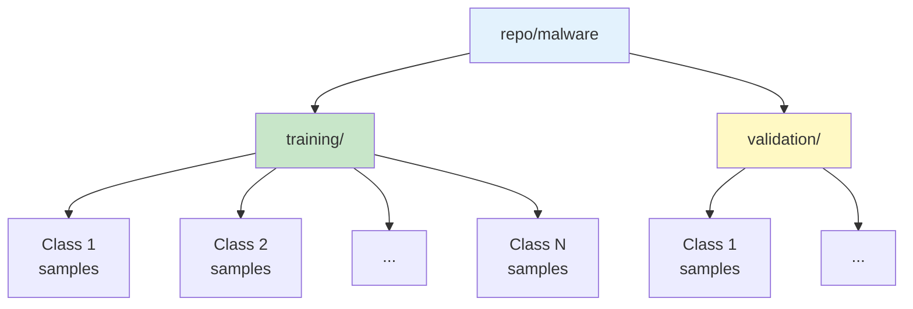
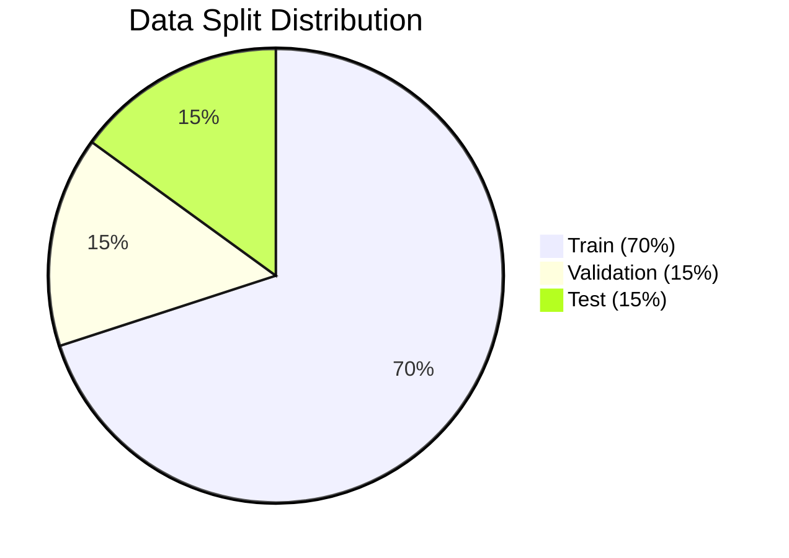
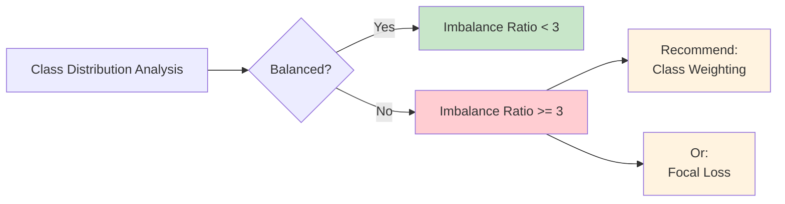
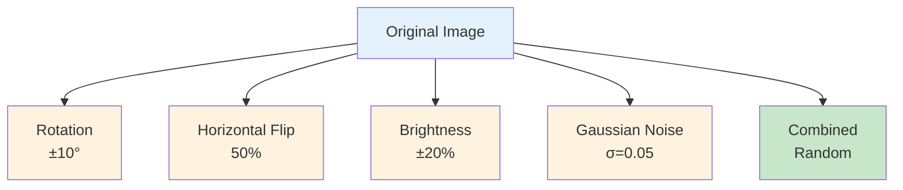

# Page 2: Dataset Configuration

## Why This Page Exists
**Purpose:** Configure train/val/test splits, preprocessing, and augmentation for the combined malware dataset. Validate data quality BEFORE training to catch issues early (class imbalance, corrupted images, bad preprocessing).

**Note:** Dataset is already combined in `repo/malware/` - no selection needed.

---

## Section 1: Dataset Overview

**Why:** Show what data we're working with from the combined dataset

**Input:** `repo/malware/` folder structure
**Process:** Scan directories and count samples
**Output:** Dataset statistics

```
[st.header] Dataset Overview

[st.info] Using combined dataset from: repo/malware/
    Total Samples: {count}
    Number of Classes: {num_classes}
    Image Format: PNG
```

**Visualization:**



**Measurement:**
- Total samples across training/ and validation/ folders
- Number of unique classes (subdirectories)
- File format validation (all images loadable)
- Average image size

---

## Section 2: Data Split

**Why:** Define how to split data into train/validation/test sets. Validation is critical for hyperparameter tuning and preventing overfitting.

**Input:** Split percentages
**Process:** Calculate resulting sample counts
**Output:** Split configuration with sample counts per set

```
[st.header] Train/Validation/Test Split

[st.columns 3]
    col1: [st.slider] "Train %" - 70% default
    col2: [st.slider] "Val %"   - 15% default
    col3: [st.slider] "Test %"  - 15% default
    - Show sum value, show warning if not sum to 100%

[st.checkbox] "Stratified Split" - True default
[st.number_input] "Random Seed" - 72 default
```

**Visualization:**



Bar chart showing sample counts per split (Plotly)

**Measurement:**
- Warn if sum != 100%
- Show resulting sample counts: Train: 6,537 | Val: 1,401 | Test: 1,401
- Verify stratification maintains class balance across splits
- Show per-class sample distribution in each split

---

## Section 3: Sample Visualization

**Why:** Preview actual images to verify dataset loaded correctly and images are recognizable

**Input:** Loaded dataset
**Process:** Display random samples
**Output:** Grid of sample images with labels

```
[st.header] Dataset Preview

[st.selectbox] "Filter by Family" - All families from dataset

[st.columns 5] Image grid showing 5 samples per row
    Each image:
        - st.image(sample)
        - st.caption(f"Family: {family_name}")

[st.number_input] "Page" - Navigate through dataset
```

**Visualization:**
- 5-column grid of malware images (grayscale visualizations of binary files)
- Caption shows malware family name
- Pagination controls

**Measurement:**
- Verify all images render without errors
- Check for corrupted files (fail to load)
- Image dimension consistency check

---

## Section 4: Class Distribution

**Why:** Identify class imbalance issues that will require special handling (class weights, focal loss)

**Input:** Dataset labels
**Process:** Count samples per class
**Output:** Bar chart showing distribution

```
[st.header] Class Distribution

[st.plotly_chart] Bar chart
    X-axis: Malware families
    Y-axis: Number of samples
    Hover: Show exact count + percentage
```

**Visualization:**



Interactive Plotly bar chart sorted by sample count

**Measurement:**
- **Imbalance ratio:** max_class_count / min_class_count
- Warn if ratio > 5 (suggest class weighting)
- Show min, max, median, std dev of class counts
- Calculate suggested class weights: `total_samples / (num_classes × class_count)`

---

## Section 5: Preprocessing Configuration

**Why:** Configure image transformations (resize, normalize). Preview ensures transformations look correct before training.

**Input:** Preprocessing parameters
**Process:** Apply transformations to sample
**Output:** Before/after comparison

```
[st.header] Image Preprocessing

[st.selectbox] "Target Size"
    Options: [224x224, 256x256, 299x299, Custom]
    - If Custom, show two number_inputs for width/height

[st.radio] "Normalization"
    Options: [[0,1], [-1,1], Z-score (dataset mean/std)]

[st.radio] "Color Mode"
    Options: [Grayscale, RGB]

[st.columns 2]
    col1: [st.image] "Before Preprocessing"
    col2: [st.image] "After Preprocessing"
    - Shows live preview of selected sample
```

**Visualization:**

```mermaid
graph LR
    A[Original<br/>Variable Size] --> B[Resize<br/>224x224]
    B --> C[Normalize<br/>[0,1]]
    C --> D[Color Mode<br/>Grayscale/RGB]
    D --> E[Preprocessed<br/>Ready for Model]

    style A fill:#ffebee
    style E fill:#c8e6c9
```

Side-by-side comparison: Original vs Preprocessed

**Measurement:**
- Verify target size matches model input requirements
- Check normalization range (e.g., min=0.0, max=1.0 for [0,1])
- Warn if grayscale but model expects RGB (or vice versa)
- Show pixel value histograms before/after normalization

---

## Section 6: Data Augmentation

**Why:** Increase dataset size artificially and improve generalization. Preview shows what augmentations will look like.

**Input:** Augmentation preset or custom parameters
**Process:** Apply augmentations to sample
**Output:** Grid showing augmented variations

```
[st.header] Data Augmentation

[st.radio] "Augmentation Preset"
    Options: [None, Light, Moderate, Heavy, Custom]

[st.expander "Configure Custom Augmentation"] (only if Custom selected)
    [st.checkbox] "Rotation" + [st.slider] "Degrees" - 0-45
    [st.checkbox] "Horizontal Flip" + [st.slider] "Probability" - 0.0-1.0
    [st.checkbox] "Vertical Flip" + [st.slider] "Probability" - 0.0-1.0
    [st.checkbox] "Brightness" + [st.slider] "Range" - 0.0-0.5
    [st.checkbox] "Contrast" + [st.slider] "Range" - 0.0-0.5
    [st.checkbox] "Gaussian Noise" + [st.slider] "Sigma" - 0.0-0.1

[st.button] "Preview Augmentation"
    - Shows 5 columns with augmented versions of same image
```

**Visualization:**



Grid showing 5 augmented versions of same image

**Measurement:**
- Effective dataset size: `original_size × augmentation_multiplier`
- Warn if augmentations too aggressive (image becomes unrecognizable)
- Show augmentation parameters in use

---

## Section 7: Confirm Dataset Configuration

**Why:** Summary checkpoint before moving to model configuration. Ensures user reviews all choices.

**Input:** All dataset configurations from above sections
**Process:** Aggregate config into JSON
**Output:** Summary + navigation to next page

```
[st.divider]

[st.success] "Dataset Configuration Complete"

[st.json] Show current dataset config summary
    {
        "dataset_path": "repo/malware",
        "total_samples": 9339,
        "num_classes": 25,
        "split": {"train": 70, "val": 15, "test": 15},
        "preprocessing": {...},
        "augmentation": "Light"
    }

[st.button] "Next: Model Configuration"
    - Saves config to st.session_state.dataset_config
    - Navigates to Model Builder page
```

**Visualization:**
- JSON tree view of full configuration
- Color-coded sections (Plotly or st.json)

**Measurement:**
- Configuration completeness check (all required fields set)
- Validation: num_classes matches dataset metadata
- Split percentages sum to 100%
- Target size > 0
